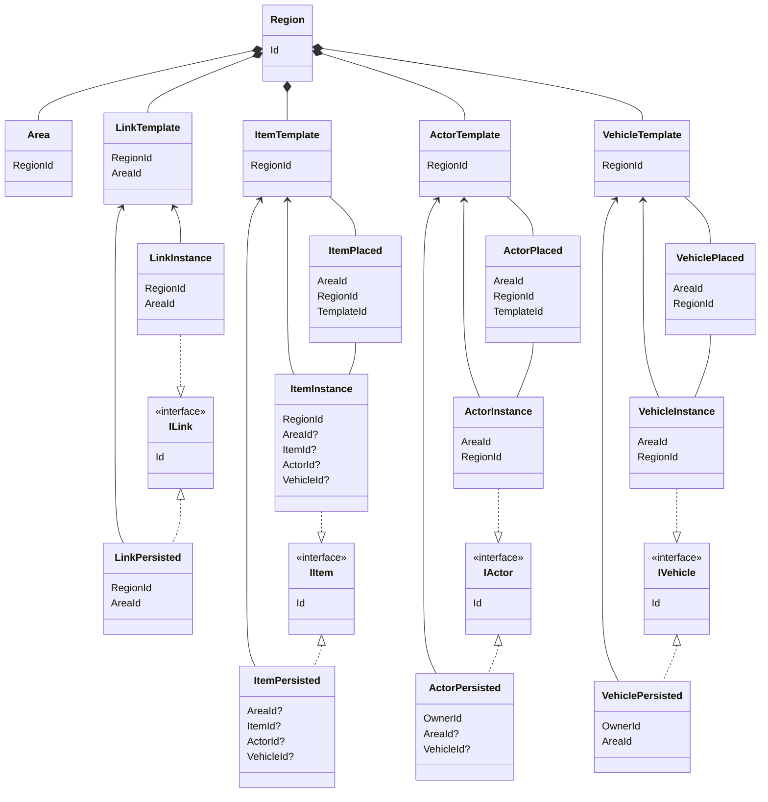
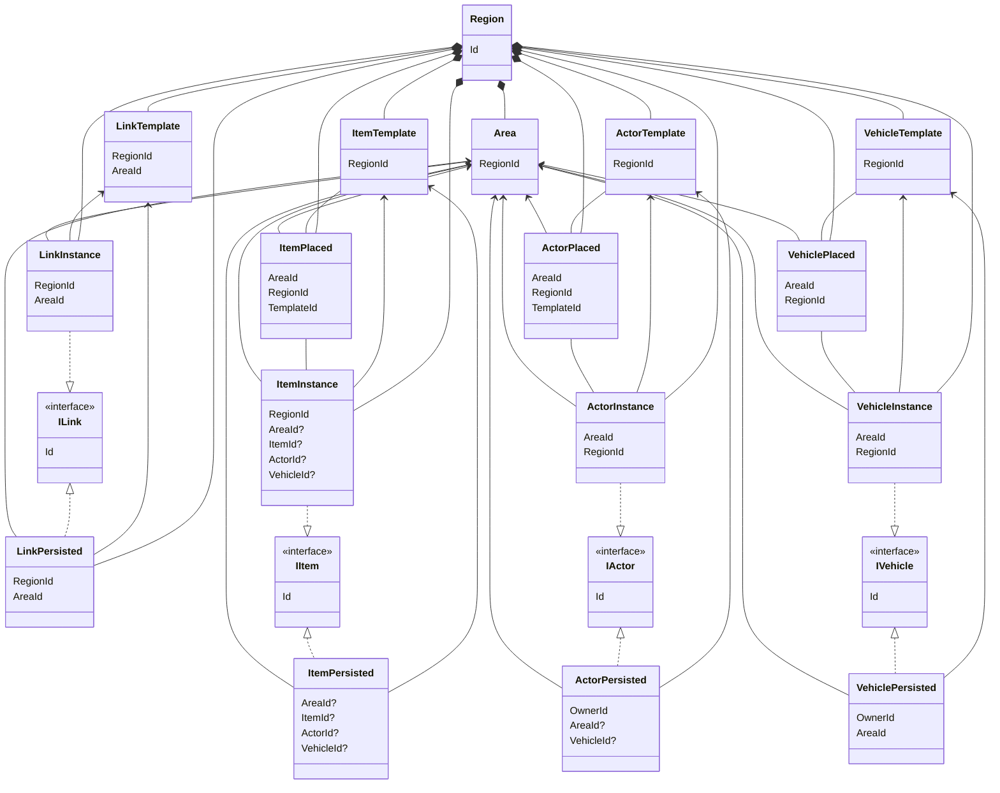
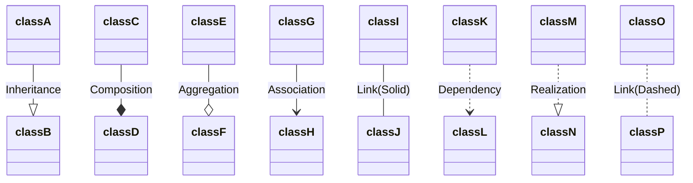

# Game Object Hierarchy

## Instance Relationships

```mermaid
classDiagram

class Region {
  Id
}

class Area {
  RegionId
}

class LinkTemplate {
  RegionId
  AreaId
}
class LinkInstance {
  RegionId
  AreaId
}
class ILink {
  <<interface>>
  Id
}
class LinkPersisted {
  RegionId
  AreaId
}

class ItemTemplate {
  RegionId
}
class ItemPlaced {
  AreaId
  RegionId
  TemplateId
}
class ItemInstance {
  RegionId
  AreaId?
  ItemId?
  ActorId?
  VehicleId?
}
class IItem {
  <<interface>>
  Id
}
class ItemPersisted {
  AreaId?
  ItemId?
  ActorId?
  VehicleId?
}

class ActorTemplate {
  RegionId
}
class ActorPlaced {
  AreaId
  RegionId
  TemplateId
}
class ActorInstance {
  AreaId
  RegionId
}
class IActor {
  <<interface>>
  Id
}
class ActorPersisted {
  OwnerId
  AreaId?
  VehicleId?
}

class VehicleTemplate {
  RegionId
}
class VehiclePlaced {
  AreaId
  RegionId
}
class VehicleInstance {
  AreaId
  RegionId
}
class IVehicle {
  <<interface>>
  Id
}
class VehiclePersisted {
  OwnerId
  AreaId
}

Region *-- Area
Region *-- LinkTemplate
Region *-- ItemTemplate
Region *-- ActorTemplate
Region *-- VehicleTemplate

LinkTemplate <-- LinkInstance
LinkTemplate <-- LinkPersisted
LinkInstance ..|> ILink
ILink <|.. LinkPersisted

ItemTemplate -- ItemPlaced
ItemTemplate <-- ItemInstance
ItemTemplate <-- ItemPersisted
ItemPlaced -- ItemInstance
ItemInstance ..|> IItem
IItem <|.. ItemPersisted

ActorTemplate -- ActorPlaced
ActorTemplate <-- ActorInstance
ActorTemplate <-- ActorPersisted
ActorPlaced -- ActorInstance
ActorInstance ..|> IActor
IActor <|.. ActorPersisted

VehicleTemplate -- VehiclePlaced
VehicleTemplate <-- VehicleInstance
VehicleTemplate <-- VehiclePersisted
VehiclePlaced -- VehicleInstance
VehicleInstance ..|> IVehicle
IVehicle <|.. VehiclePersisted
```

## Full Relationships

```mermaid
classDiagram

class Region {
  Id
}

class Area {
  RegionId
}

class LinkTemplate {
  RegionId
  AreaId
}
class LinkInstance {
  RegionId
  AreaId
}
class ILink {
  <<interface>>
  Id
}
class LinkPersisted {
  RegionId
  AreaId
}

class ItemTemplate {
  RegionId
}
class ItemPlaced {
  AreaId
  RegionId
  TemplateId
}
class ItemInstance {
  RegionId
  AreaId?
  ItemId?
  ActorId?
  VehicleId?
}
class IItem {
  <<interface>>
  Id
}
class ItemPersisted {
  AreaId?
  ItemId?
  ActorId?
  VehicleId?
}

class ActorTemplate {
  RegionId
}
class ActorPlaced {
  AreaId
  RegionId
  TemplateId
}
class ActorInstance {
  AreaId
  RegionId
}
class IActor {
  <<interface>>
  Id
}
class ActorPersisted {
  OwnerId
  AreaId?
  VehicleId?
}

class VehicleTemplate {
  RegionId
}
class VehiclePlaced {
  AreaId
  RegionId
}
class VehicleInstance {
  AreaId
  RegionId
}
class IVehicle {
  <<interface>>
  Id
}
class VehiclePersisted {
  OwnerId
  AreaId
}

Region *-- Area
Region *-- LinkTemplate
Region *-- ItemTemplate
Region *-- ActorTemplate
Region *-- VehicleTemplate
Region *-- LinkInstance
Region *-- LinkPersisted
Region *-- ItemPlaced
Region *-- ItemInstance
Region *-- ActorPlaced
Region *-- ActorInstance
Region *-- VehiclePlaced
Region *-- VehicleInstance

LinkTemplate <-- LinkInstance
LinkTemplate <-- LinkPersisted
LinkInstance ..|> ILink
ILink <|.. LinkPersisted
Area <-- LinkInstance
Area <-- LinkPersisted

ItemTemplate -- ItemPlaced
ItemTemplate <-- ItemInstance
ItemTemplate <-- ItemPersisted
ItemPlaced -- ItemInstance
ItemInstance ..|> IItem
IItem <|.. ItemPersisted
Area <-- ItemPlaced
Area <-- ItemInstance
Area <-- ItemPersisted

ActorTemplate -- ActorPlaced
ActorTemplate <-- ActorInstance
ActorTemplate <-- ActorPersisted
ActorPlaced -- ActorInstance
ActorInstance ..|> IActor
IActor <|.. ActorPersisted
Area <-- ActorPlaced
Area <-- ActorInstance
Area <-- ActorPersisted

VehicleTemplate -- VehiclePlaced
VehicleTemplate <-- VehicleInstance
VehicleTemplate <-- VehiclePersisted
VehiclePlaced -- VehicleInstance
VehicleInstance ..|> IVehicle
IVehicle <|.. VehiclePersisted
Area <-- VehiclePlaced
Area <-- VehicleInstance
Area <-- VehiclePersisted
```

```mermaid
classDiagram
classA --|> classB : Inheritance
classC --* classD : Composition
classE --o classF : Aggregation
classG --> classH : Association
classI -- classJ : Link(Solid)
classK ..> classL : Dependency
classM ..|> classN : Realization
classO .. classP : Link(Dashed)
```
