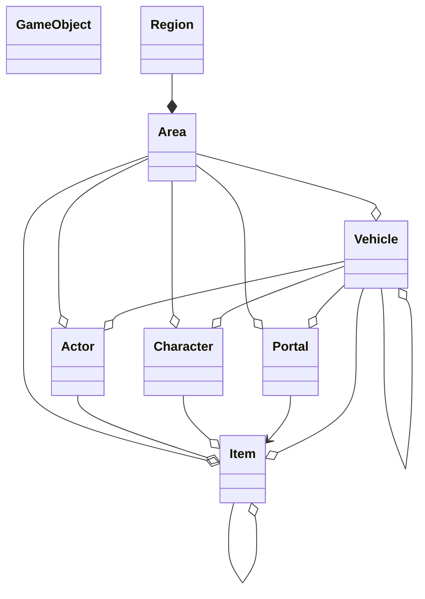
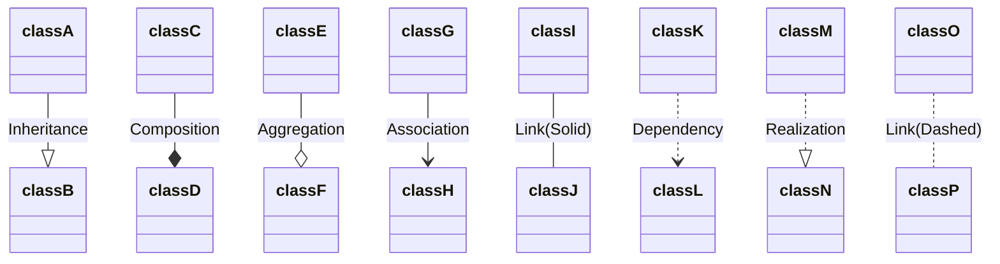

```mermaid
classDiagram

class GameObject

%% Area --|> GameObject
%% Actor --|> GameObject
%% Character --|> GameObject
%% Item --|> GameObject
%% Portal --|> GameObject
%% Vehicle --|> GameObject

Region --* Area
Area --o Actor
Area --o Character
Area --o Item
Area --o Portal
Area --o Vehicle

Actor --o Item
Character --o Item
Item --o Item
Portal --> Item
Vehicle --o Actor
Vehicle --o Character
Vehicle --o Item
Vehicle --o Portal
Vehicle --o Vehicle

```

```mermaid
classDiagram
classA --|> classB : Inheritance
classC --* classD : Composition
classE --o classF : Aggregation
classG --> classH : Association
classI -- classJ : Link(Solid)
classK ..> classL : Dependency
classM ..|> classN : Realization
classO .. classP : Link(Dashed)
```
